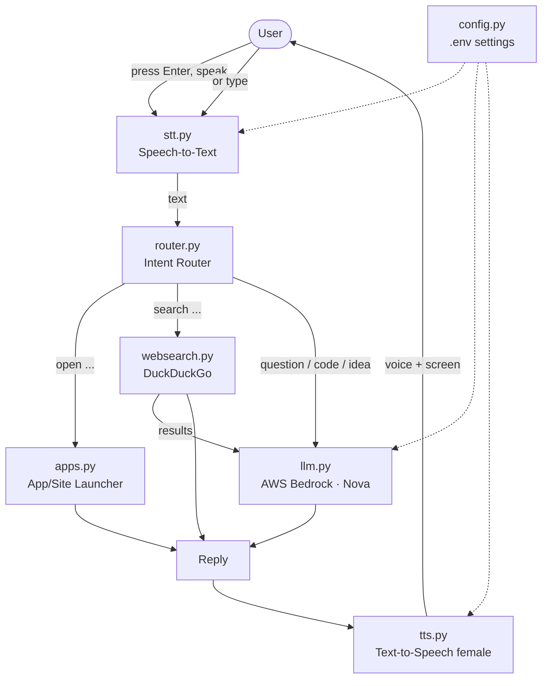
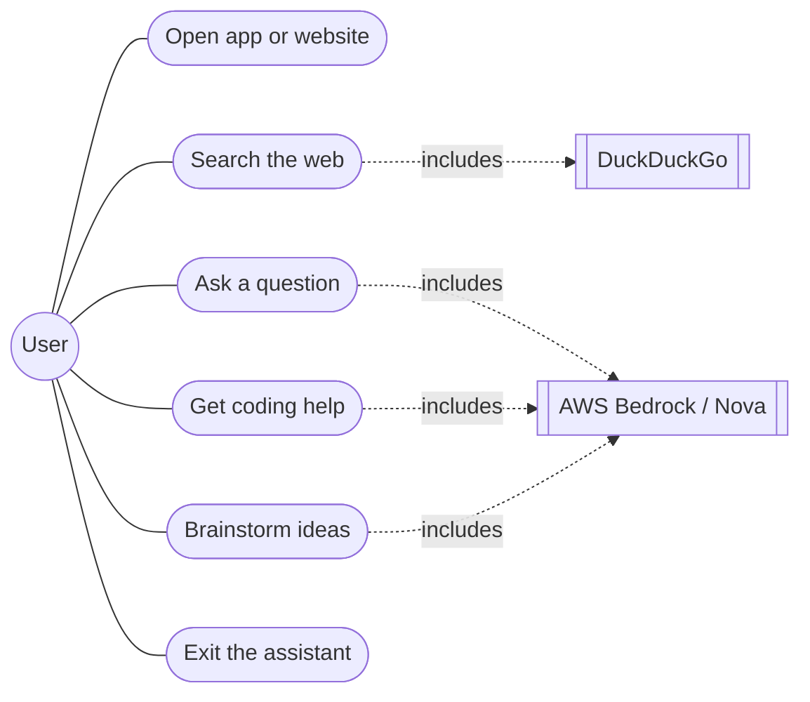
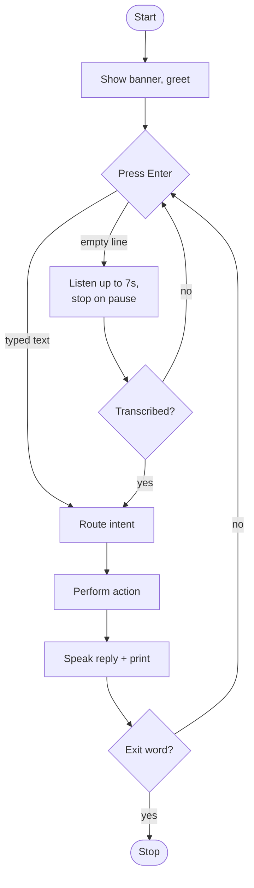
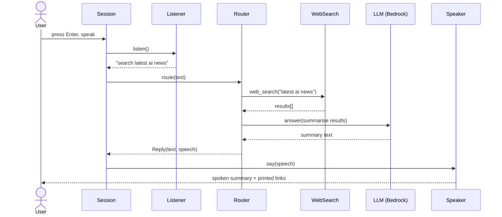
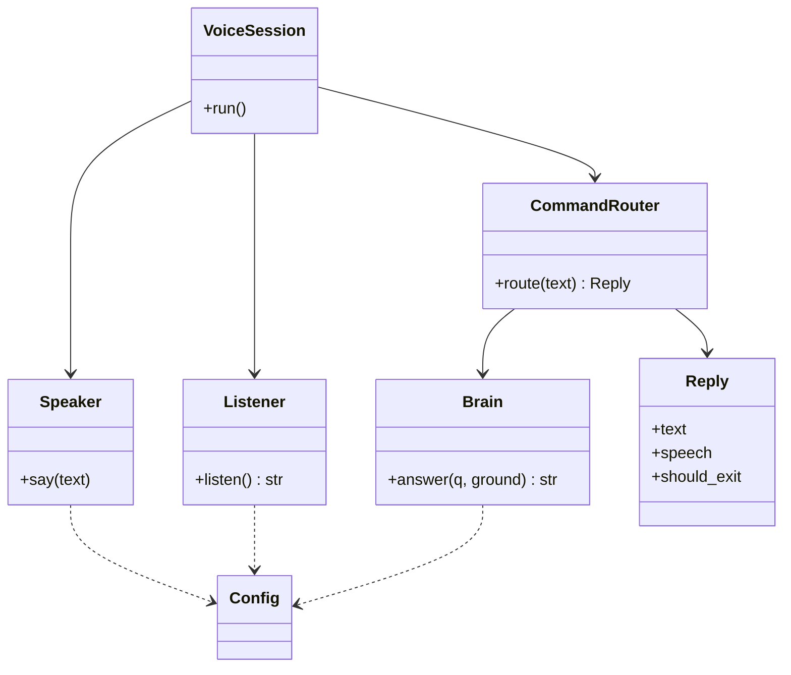

# Terminal Voice Assistant — Project Report

---

## 1. Cover Page

| | |
|---|---|
| **Project Title** | Terminal Voice Assistant (Python) |
| **Type** | Voice-controlled command-line AI assistant |
| **Language** | Python 3.10+ |
| **Key Technologies** | SpeechRecognition, pyttsx3, AWS Bedrock (Amazon Nova), DuckDuckGo |
| **Version Control** | Git / GitHub |
| **Submission** | VITyarthi — Build Your Own Project |

---

## 2. Introduction

The Terminal Voice Assistant is a hands-light, voice-driven program that runs
entirely in the terminal. The user presses Enter, speaks a command, and the
assistant transcribes the speech, decides what the user wants, performs the
action, and replies out loud in a natural female voice.

It combines three classic areas of computer science into one small, readable
codebase: **human–computer interaction** (speech input/output), **information
retrieval** (live web search), and **applied AI** (a large language model for
reasoning). The whole system is written in modular Python so it can be studied,
tested, and extended.

---

## 3. Problem Statement

Everyday computer interaction is dominated by typing and clicking, which is slow
for quick actions like opening an app, searching the web, or asking a short
question. Commercial voice assistants that solve this are closed, hardware-bound,
and impossible to inspect or extend.

**This project delivers an open, fully-Python, terminal voice assistant** that
listens to a spoken command, understands the intent, acts on it (open an app,
search the web, or reason with an LLM), and speaks the answer back — all from
the terminal, with settings and secrets in a single `.env` file.

See [statement.md](statement.md) for the full problem statement, scope, target
users, and high-level features.

---
## 4. Functional Requirements

The system provides **three major functional modules**, plus the voice I/O loop
that ties them together.

**Module A — Application & Website Launcher** (`bot/apps.py`)
- FR-1: Open desktop apps by voice: Notepad, Calculator, VS Code, Command
  Prompt, File Explorer.
- FR-2: Open websites by voice: YouTube, Gmail, GitHub, Google, LinkedIn, Slack.
- FR-3: Report clearly when an app cannot be found instead of failing silently.

**Module B — Web Search** (`bot/websearch.py`)
- FR-4: On "search …" / "google …", fetch live DuckDuckGo results (no API key).
- FR-5: Speak a grounded summary and print the top source links.

**Module C — AI Reasoning Brain** (`bot/llm.py`)
- FR-6: Answer general questions via AWS Bedrock (Amazon Nova) Converse API.
- FR-7: Help write and explain code (code shown on screen, summary spoken).
- FR-8: Brainstorm ideas and hold a natural spoken conversation.
- FR-9: Ground time-sensitive questions with web search automatically.

**Voice interaction loop** (`bot/stt.py`, `bot/tts.py`, `bot/session.py`)
- FR-10: Press Enter to talk; 7-second window to begin speaking.
- FR-11: Recording ends automatically when the user pauses.
- FR-12: Reply is spoken in a female voice and echoed on screen.
- FR-13: After acting, the assistant waits for the user to return to the
  terminal (press Enter) before listening again.
- FR-14: If no microphone is present, accept typed commands instead.
- FR-15: "exit" / "quit" / "goodbye" ends the session.

### Input / Output Structure

| Input | Processing | Output |
|-------|-----------|--------|
| Spoken command (mic) or typed text | STT → intent routing → action | Spoken reply (female voice) + terminal text |
| "open notepad" | Launcher module | Notepad opens; "Opening Notepad." |
| "search AI news" | Web search + LLM summary | Spoken summary + printed links |
| "write a bubble sort" | LLM (Bedrock) | Code printed; spoken lead-in |

---

## 5. Non-Functional Requirements

- **NFR-1 Performance** — a fresh TTS engine per utterance avoids run-loop
  dead-locks; the Bedrock client is created lazily and cached for reuse.
- **NFR-2 Usability** — one-key interaction (press Enter), spoken + on-screen
  replies, and clear examples in the startup banner.
- **NFR-3 Reliability / Error handling** — every external call (mic, network,
  AWS, app launch) is wrapped in `try/except`; failures return a friendly
  message and the loop continues.
- **NFR-4 Security** — secrets live only in a git-ignored `.env`; no third-party
  messaging or outbound data beyond AWS and DuckDuckGo; access key is masked in
  logs.
- **NFR-5 Maintainability** — modular package (one responsibility per file),
  docstrings throughout, and unit tests for the pure logic.
- **NFR-6 Portability** — pure Python; degrades to typed input where no mic
  exists; configuration is environment-driven.

---

## 6. System Architecture

The assistant follows a simple **pipeline architecture** with a central router.
Each stage is an independent, replaceable module.

---

## 7. Design Diagrams

### 7.1 Use Case Diagram

### 7.2 Workflow / Process Flow Diagram

### 7.3 Sequence Diagram — "search latest AI news"

### 7.4 Class / Component Diagram

### 7.5 ER Diagram / Storage Design

**Not applicable.** The assistant is stateless and uses no database — each
command is handled independently. Configuration is read from the `.env` file at
startup. (Included here for completeness per the report template.)

---

## 8. Design Decisions & Rationale

- **Modular package over one big file** — each concern (config, STT, TTS,
  search, LLM, apps, routing, session) is its own module, making the code easy
  to read, test, and extend.
- **Press-Enter-to-talk instead of always-listening** — prevents the assistant
  from transcribing its own spoken reply or background noise, and gives the user
  full control over each turn (directly matches the required behaviour).
- **Amazon Nova via APAC inference profile** — Nova Lite is cost-effective and
  available in `ap-south-1` (Mumbai) through the `apac.amazon.nova-lite-v1:0`
  inference profile, which on-demand invocation requires.
- **Split spoken vs printed output** — code and long text are printed in full,
  while a short, clean summary is spoken, keeping audio pleasant.
- **DuckDuckGo for search** — free, no API key, privacy-friendly, and simple.
- **Terminal-only, no messaging** — removed the earlier WhatsApp feature and all
  web/GUI code for safety, simplicity, and a pure-Python footprint.

---

## 9. Implementation Details

- **`config.py`** — a `dataclass` reads every setting from `.env` once; exposes
  helpers like `has_bedrock_credentials()` and `masked_key()`.
- **`stt.py`** — `Listener` uses `SpeechRecognition` with `timeout=7`,
  `phrase_time_limit`, and a `pause_threshold`; falls back to `input()`.
- **`tts.py`** — `Speaker` picks a female SAPI voice by name hints and speaks a
  `clean_for_speech()`-processed string (markdown and code stripped).
- **`websearch.py`** — `web_search()` returns typed dicts; `format_context()`
  grounds the LLM; `format_sources()` prints links.
- **`llm.py`** — `Brain` lazily builds the Bedrock client and calls `converse()`
  with a system prompt; auto-grounds current-events questions with search.
- **`apps.py`** — dictionaries map spoken keywords to executables/URLs; launches
  via `subprocess`/`webbrowser`.
- **`router.py`** — `CommandRouter.route()` classifies intent and returns a
  `Reply(text, speech, should_exit)`.
- **`session.py`** — `VoiceSession.run()` is the press-Enter-to-talk loop.

---

## 10. Screenshots / Results

_Add screenshots of:_
1. The startup banner.
2. A spoken "open youtube" opening the browser.
3. A "search …" answer with printed sources.
4. A coding question with code printed in the terminal.

Observed results: commands are recognised within the 7-second window, actions
execute correctly, and replies are both spoken and printed.

---

## 11. Testing Approach

- **Unit tests** (`tests/test_bot.py`, `unittest`): speech cleaning, search
  formatting, and router intent detection using a fake brain (no mic, network,
  or AWS). Run: `python -m unittest discover -s tests -v` — 9 tests pass.
- **Integration/connectivity test** (`test_bedrock.py`): verifies AWS Bedrock
  credentials and the Nova inference profile with a live "Reply with OK" call.
- **Manual testing**: each intent exercised by voice and by typed input;
  error paths checked by removing the mic and by using invalid app names.

---

## 12. Challenges Faced

- **Bedrock on-demand vs inference profile** — bare `amazon.nova-lite-v1:0`
  raised a ValidationException in `ap-south-1`; solved with the
  `apac.amazon.nova-lite-v1:0` inference profile.
- **IAM permissions** — the initial key lacked `bedrock:InvokeModel`; fixed by
  attaching the right policy.
- **pyttsx3 run-loop hangs** — reusing one engine across calls dead-locked;
  solved by creating a fresh engine per utterance.
- **Assistant hearing itself** — always-on listening captured the spoken reply;
  solved with the press-Enter-to-talk turn model.
- **PyAudio on Windows** — native build can fail; documented the
  `pipwin install pyaudio` fallback.

---

## 13. Learnings & Key Takeaways

- How to combine speech I/O, information retrieval, and an LLM into one pipeline.
- Practical use of the AWS Bedrock Converse API and inference profiles.
- The value of modular design and small unit tests for readability and grading.
- Handling secrets safely with `.env` and `.gitignore`, and rotating keys.
- Designing interaction flow (turn-taking) around real-world constraints (a
  microphone that would otherwise hear the speaker).

---

## 14. Future Enhancements

- Wake-word ("Hey Assistant") so no Enter press is needed.
- Conversation memory across turns for follow-up questions.
- More app integrations and OS-specific launchers (macOS/Linux).
- Offline STT (e.g. Vosk) for a fully offline mode.
- Streaming LLM responses for faster spoken replies.

---

## 15. References

- AWS Bedrock Converse API — https://docs.aws.amazon.com/bedrock/
- Amazon Nova models — https://docs.aws.amazon.com/nova/
- SpeechRecognition — https://pypi.org/project/SpeechRecognition/
- pyttsx3 — https://pyttsx3.readthedocs.io/
- duckduckgo-search (ddgs) — https://pypi.org/project/duckduckgo-search/
- python-dotenv — https://pypi.org/project/python-dotenv/

